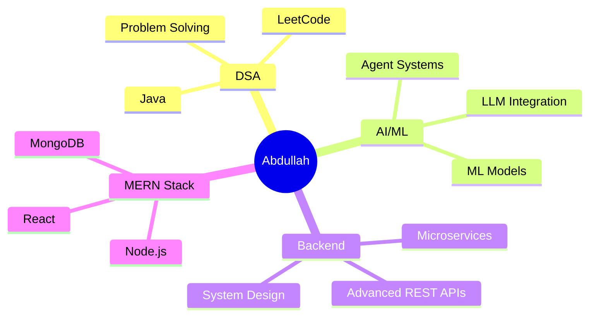

<div align="center">

<!-- Animated Banner -->


<!-- Typing SVG -->
<a href="https://git.io/typing-svg">
  
</a>

<br/>

<!-- Profile Views & Followers -->

&nbsp;
<a href="https://github.com/Abdullah-218?tab=followers">
  
</a>

</div>

---

<!-- About Me Section -->


##  About Me

```yaml
name        : Abdullah
location    : Pondicherry, India
role        : Backend Developer | MERN Stack Engineer | AI Enthusiast
focus       : MERN Stack + AI Integrated Solutions
status      : Exploring AI/ML, Backend Architectures & DSA (Java)
achievement : Pre-Finalist — Unisys Innovation Challenge (Top 50 / 1000+)
              Finalist — INCEPTO Hackathon
              NPTEL Domain Star | Top 2% in DSA (Java) Nationwide
```

<details>
<summary><b>🔍 More About Me</b></summary>
<br/>

- 🛡️ **Team Leader** @ *Intel AI MediLocker* — AI-powered healthcare platform  
- 🤖 Passionate about building **intelligent backend systems** with real-world impact  
- 📊 Currently deep-diving into **DSA with Java**, **AI/ML integrations**, and **agentic AI architectures**  
- 🏅 **NPTEL Domain Star** — 50+ weeks of CS domain | **Elite badge** holder  
- 🌱 1M1B AI + Sustainability Intern (IBM SkillsBuild) — March 2025  
- ⚡ Fun fact: I turn coffee into scalable REST APIs ☕ → 🔧  

</details>

---

## 🚀 Featured Projects

<div align="center">

<!-- Project Cards -->

### 🧠 Intel AI MediLocker
[](https://github.com/Abdullah-218)

</div>

<table>
  <tr>
    <td width="50%" valign="top">
      <h3 align="center">🧠 Intel AI MediLocker</h3>
      <p align="center"><code>Flutter</code> <code>Supabase</code> <code>Python ML</code></p>
      <p>AI-powered healthcare platform with OTP authentication, secure medical records, drug interaction & allergy detection. ML-based side-effect prediction, specialist mapping, and digital prescription automation.</p>
      <p>🏅 <b>Pre-Finalist — Unisys Innovation Challenge (Top 50 / 1000+)</b></p>
      <p>📅 Apr 2025 – May 2025 &nbsp;|&nbsp; 👤 Team Leader</p>
    </td>
    <td width="50%" valign="top">
      <h3 align="center">🏢 Multi-Tenant MERN Blogging Platform</h3>
      <p align="center"><code>MERN</code> <code>JWT</code> <code>Docker</code></p>
      <p>Production-style multi-tenant institutional blogging platform with role-based access (Super Admin → Org Admin → Dept Admin → Verified Users) and hierarchical content governance. Scalable REST APIs with MongoDB relational modeling.</p>
      <p>📅 Nov 2025 – Dec 2025 &nbsp;|&nbsp; 👤 Full Stack Developer</p>
    </td>
  </tr>
  <tr>
    <td width="50%" valign="top">
      <h3 align="center">🤖 CareerPilot AI</h3>
      <p align="center"><code>Python</code> <code>MERN</code> <code>Groq LLM</code></p>
      <p>Agentic AI Career Navigation System with multi-agent orchestration. Analyzes user profiles, evaluates market demand, generates personalized learning roadmaps, with persistent state tracking and continuous feedback loops.</p>
      <p>🏅 <b>Finalist — INCEPTO Hackathon</b></p>
      <p>📅 Jan 2026 – Feb 2026 &nbsp;|&nbsp; 👤 Agent Developer</p>
    </td>
    <td width="50%" valign="top">
      <h3 align="center">🔭 What's Next?</h3>
      <p align="center">Always building something new...</p>
      <br/>
      <p align="center">
        
      </p>
    </td>
  </tr>
</table>

---

## 🏆 Achievements

<div align="center">

| 🥇 Achievement | 📅 Date | 🔗 Details |
|---|---|---|
| 🏅 **Unisys Innovation Challenge Pre-Finalist** | May 2025 | Top 50 / 1000+ nationally for Intel AI MediLocker |
| 🤖 **1M1B AI + Sustainability Intern** | Mar 2025 | IBM SkillsBuild — AI-driven social impact |
| ⭐ **NPTEL Domain Star** | Ongoing | 50+ weeks of CS Domain · Elite Badge |
| 🥇 **NPTEL DSA (Java) — Top 2%** | Recent | Topper nationwide in Data Structures using Java |
| 🏁 **INCEPTO Hackathon Finalist** | Feb 2026 | CareerPilot AI — autonomous career guidance |

</div>

---

## 🛠️ Tech Stack

<div align="center">

**Languages**


**Frontend & Mobile**


**Backend & Frameworks**


**Databases**


**Tools & DevOps**


**AI / ML**


</div>

---

## 📈 GitHub Stats

<div align="center">


<br/><br/>


<br/><br/>

<!-- Activity Graph -->


</div>

---

## 📚 Currently Exploring

<div align="center">



</div>

---

## 🏅 Competitive Programming

<div align="center">

<a href="https://leetcode.com/u/abdullxh_08/" target="_blank">
  
</a>

</div>

---

## 📫 Connect With Me

<div align="center">

<a href="http://www.linkedin.com/in/abdullahxdev" target="_blank">
  
</a>
&nbsp;&nbsp;
<a href="mailto:abdullahoffl2005@gmail.com">
  
</a>

<br/><br/>

<!-- Snake animation -->
<picture>
  <source media="(prefers-color-scheme: dark)" srcset="https://raw.githubusercontent.com/Abdullah-218/Abdullah-218/output/github-contribution-grid-snake-dark.svg">
  <source media="(prefers-color-scheme: light)" srcset="https://raw.githubusercontent.com/Abdullah-218/Abdullah-218/output/github-contribution-grid-snake.svg">
  
</picture>

</div>

---

<div align="center">

<!-- Quote -->


<br/><br/>

<!-- Footer wave -->


</div>
