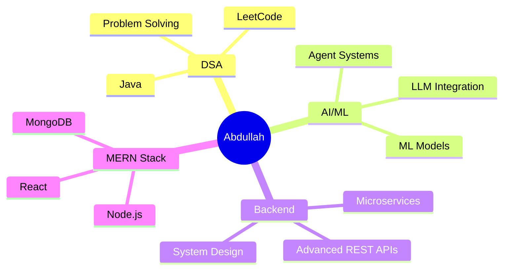

<div align="center">

<!-- Animated Banner -->


<!-- Typing SVG -->
<a href="https://git.io/typing-svg">
  
</a>

<br/>

<!-- Profile Views & Followers -->

&nbsp;
<a href="https://github.com/Abdullah-218?tab=followers">
  
</a>

</div>

---

## About Me

```yaml
name        : Abdullah
location    : Pondicherry, India
role        : Backend Developer | MERN Stack Engineer | AI Enthusiast
focus       : MERN Stack + AI Integrated Solutions
status      : Exploring AI/ML, Backend Architectures & DSA (Java)
highlights  : Pre-Finalist — Unisys Innovation Challenge (Top 50 / 1000+)
              Top 2% in DSA (Java) Nationwide
```

<details>
<summary><b>More About Me</b></summary>
<br/>

- **Team Leader** @ *Intel AI MediLocker* — AI-powered healthcare platform
- Passionate about building **intelligent backend systems** with real-world impact
- Currently deep-diving into **DSA with Java**, **AI/ML integrations**, and **agentic AI architectures**
- **NPTEL Domain Star** — 50+ weeks of CS domain | **Elite badge** holder
- 1M1B AI + Sustainability Intern (IBM SkillsBuild) — March 2025

</details>

---

## Featured Projects

<table>
  <tr>
    <td width="100%">


<p align="center"><i>Smart Medical Report and Prediction App</i></p>

<p align="center">


</p>

> Built an AI-powered healthcare platform with OTP authentication, secure medical records, and drug interaction & allergy detection. Implemented ML-based side-effect prediction, specialist mapping, and digital prescription automation; led a 4-member team.

</td>
  </tr>
  <tr>
    <td width="100%">


<p align="center"><i>Agentic Career Navigation Platform</i></p>

<p align="center">


</p>

> Built an Agentic AI Career Navigation System that analyzes user profiles, evaluates market demand, and generates personalized learning roadmaps using multi-agent orchestration. Implemented readiness assessment, market intelligence, rerouting, and action evaluation with persistent state tracking.

</td>
  </tr>
  <tr>
    <td width="100%">


<p align="center"><i>Multi-Tenant MERN Blogging Platform</i></p>

<p align="center">


</p>

> Developed a production-style multi-tenant institutional blogging platform featuring role-based access (Super Admin, Org Admin, Dept Admin, Verified Users) and hierarchical content governance. Engineered scalable REST APIs, verification workflows, and organization-scoped publishing with MongoDB relational modeling.

</td>
  </tr>
</table>

---

## Tech Stack

<div align="center">

**Languages**


**Frontend & Mobile**


**Backend & Frameworks**


**Databases**


**Tools & DevOps**


**AI / ML**


</div>

---

## GitHub Stats

<div align="center">


<br/><br/>


</div>

---

## Currently Exploring

<div align="center">



</div>

---

## Competitive Programming

<div align="center">

<a href="https://leetcode.com/u/abdullxh_08/" target="_blank">
  
</a>

</div>

---

## Connect With Me

<div align="center">

<a href="http://www.linkedin.com/in/abdullahxdev" target="_blank">
  
</a>
&nbsp;&nbsp;
<a href="mailto:abdullahoffl2005@gmail.com">
  
</a>

</div>

---

<div align="center">

<!-- Footer wave -->


</div>
